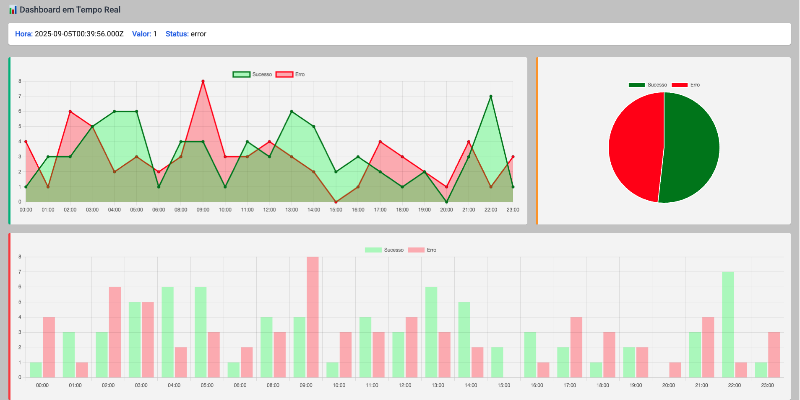

# 📊 Real-Time Dashboard (Node.js + Angular)

Este projeto é um **Dashboard em tempo real** desenvolvido com **Node.js (backend)** e **Angular (frontend)**, utilizando **WebSockets (Socket.IO)** para comunicação em tempo real e **Chart.js** para visualização de dados.
---

## 📸 Demonstração


---

## 🚀 Tecnologias

- **Backend**
  - Node.js
  - Express
  - Socket.IO

- **Frontend**
  - Angular 13+
  - RxJS
  - ng2-charts (Chart.js)

---

## 🛠️ Roadmap de Desenvolvimento

### 1. Planejamento
- [X] Definir escopo do dashboard (quais métricas serão exibidas).
- [X] Escolher banco de dados ou fonte de dados (MongoDB, MySQL, Redis ou simulação).
- [X] Decidir arquitetura: monolito simples ou microserviços.

### 2. Backend (Node.js)
- [X] Criar servidor com Express.
- [X] Integrar Socket.IO para envio de dados em tempo real.
- [X] Implementar endpoint REST de saúde (`/health`) para monitoramento.
- [X] Simular geração de dados ou integrar com fonte real.

### 3. Frontend (Angular)
- [X] Criar projeto Angular (`ng new dashboard-app`).
- [X] Instalar dependências: `socket.io-client`, `ng2-charts`, `chart.js`.
- [X] Criar service para consumir WebSockets.
- [X] Criar componente `dashboard` para exibir métricas em tempo real.
- [X] Adicionar gráficos dinâmicos (line chart, bar chart, pie).
- [X] Adicionar classe de estilo com Angular Material para layout do componente `dashboard`.

### 4. Integração
- [X] Conectar frontend ao backend via WebSocket.
- [X] Testar atualização em tempo real no browser.

### 5. Deploy
- [X] Criar Dockerfile para backend e frontend.
- [X] Criar docker-compose.yml para subir ambiente.
- [X] Deploy em ambiente Docker.
- [X] Gerar versão 1.0.0.

---

## 📦 Implatar ambiente docker
```bash
docker-compose up -d --build
```